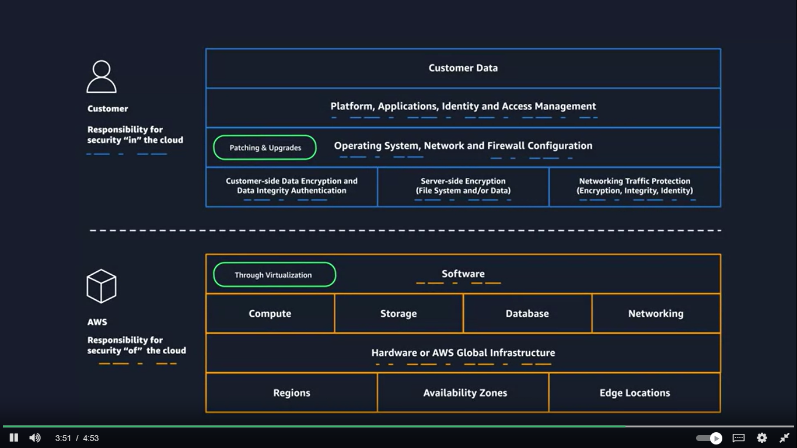
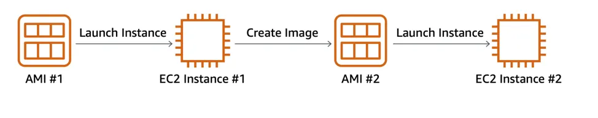

### Aws

AWS provides us with data center to store data but lets say due to some disaster the data center brks down then they have another data center this cluster of data center is called AZ availaibility zone. 
Regions are clusters of Availability Zones. Availability Zones are clusters of data centers

IAM is a web service that enables you to manage access to your AWS account and resources. It also provides a centralized view of who and what are allowed inside your AWS account

At a fundamental level, there are three types of compute options: virtual machines, container services, and serverless.

To run these virtual machines, you install a hypervisor on a host machine. This hypervisor provisions the resources to create and run your virtual machines.In AWS, these virtual machines are called Amazon Elastic Compute Cloud or Amazon EC2.

### What Is Amazon EC2?
It allows you to provision virtual servers called EC2 instances. 

### What Is an AMI?
operating system installation is no longer your responsibility, and is instead built into the AMI that you choose.Not only does an AMI let you configure which operating system you want, you can also select storage mappings, the architecture type (such as 32-bit, 64-bit, or 64-bit ARM), and additional software installed.

EC2 instances are live instantiations of what is defined in an AMI, 

When you launch a new instance, AWS allocates a virtual machine that runs on a hypervisor. Then the AMI you selected is copied to the root device volume, which contains the image used to boot the volume. In the end, you get a server you can connect to and install packages and any additional software.

Each AMI in the AWS Management Console has an AMI ID, which is prefixed by “ami-”, followed by a random hash of numbers and letters. These IDs are unique to each AWS region.

What Makes Up an EC2 Instance?
EC2 instances are a combination of virtual processors (vCPUs), memory, network, and in some cases, instance storage and graphics processing units (GPUs). When you create an EC2 instance, you need to choose how much you need of each of these components.

c5.large can be broken down into the following elements. 

    c5 determines the instance family and generation number. Here, the instance belongs to the fifth generation of instances in an instance family that’s optimized for generic computation.
    
    large, which determines the amount of instance capacity.

#### Instance Families

| Family               | Description                                                                                                          |
|----------------------|----------------------------------------------------------------------------------------------------------------------|
| General purpose      | Provides a balance of compute, memory, and networking resources, and can be used for a variety of workloads.          |
| Compute optimized    | Ideal for compute-bound applications that benefit from high-performance processors.                                   |
| Memory optimized     | Designed to deliver fast performance for workloads that process large data sets in memory.                            |
| Accelerated computing| Use hardware accelerators or co-processors to perform functions such as floating-point number calculations, graphics processing, or data pattern matching more efficiently than is possible with conventional CPUs. |
| Storage optimized    | Designed for workloads that require high, sequential read and write access to large data sets on local storage. They are optimized to deliver tens of thousands of low-latency random I/O operations per second (IOPS) to applications that replicate their data across different instance. |
