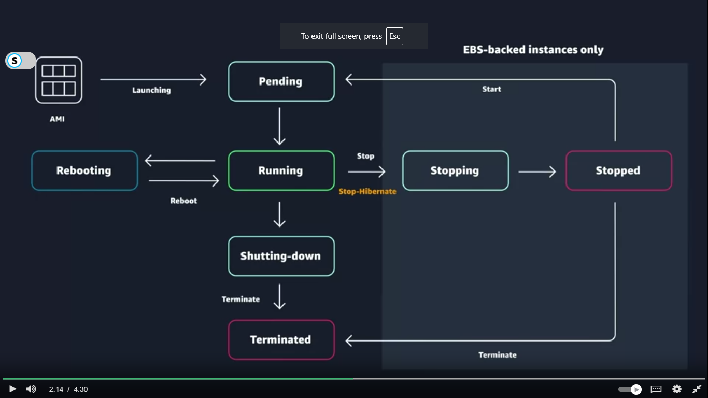
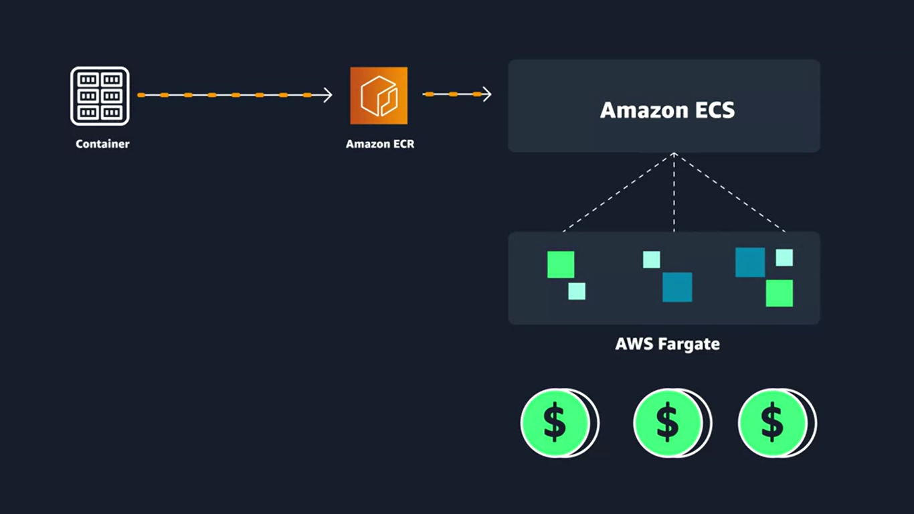
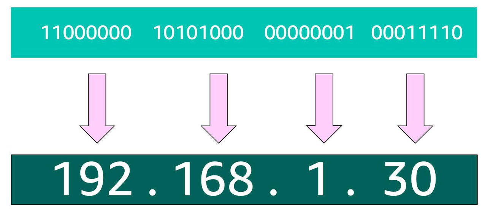
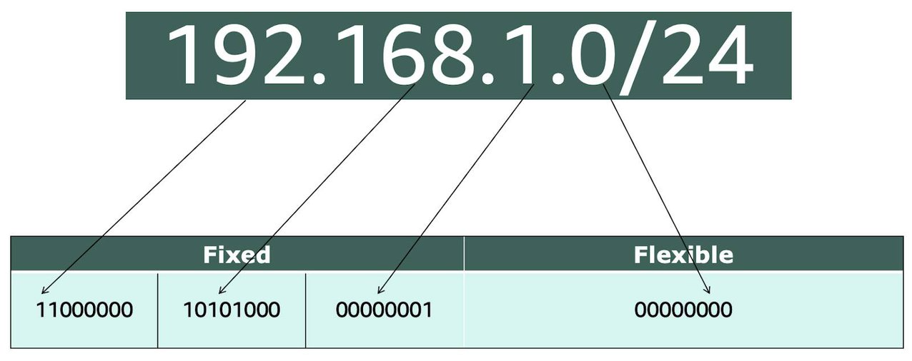
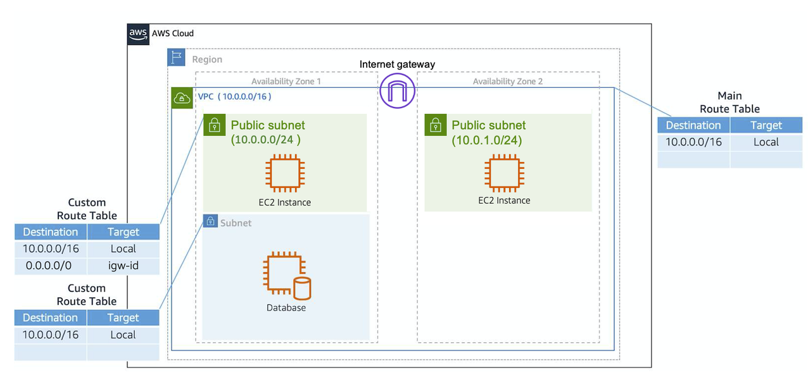
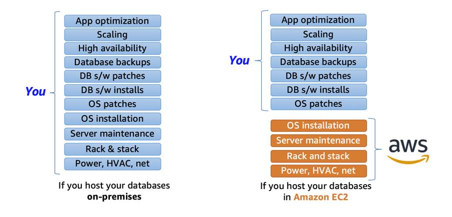
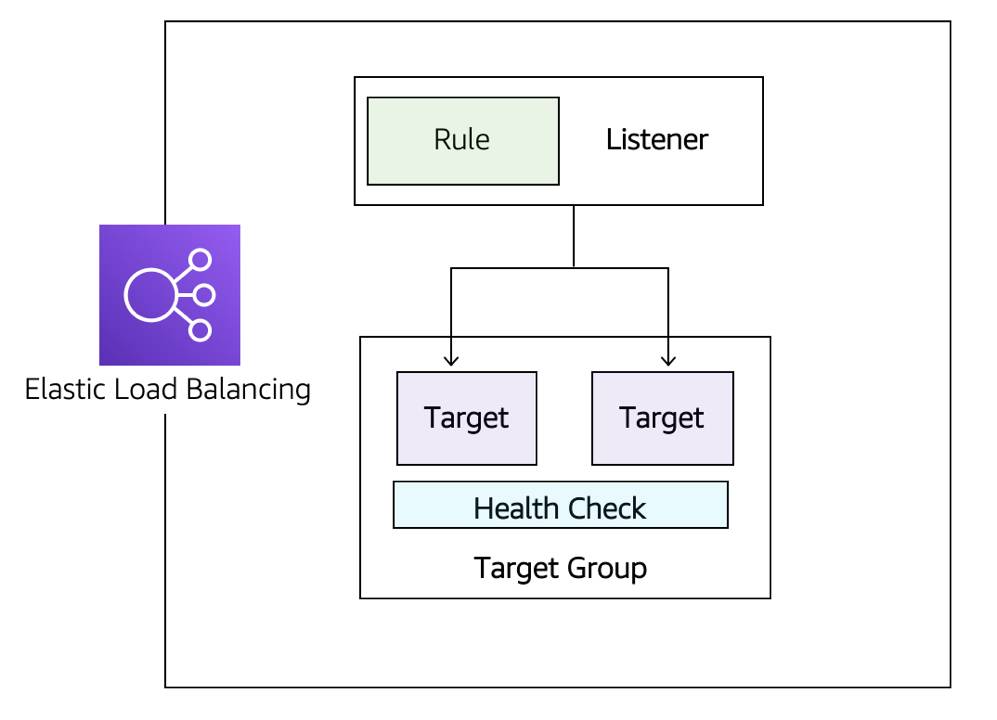
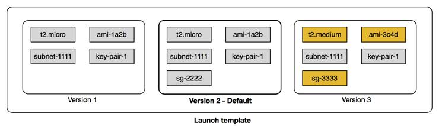

### Aws

AWS provides us with data center to store data but lets say due to some disaster the data center brks down then they have another data center this cluster of data center is called AZ availaibility zone. 
Regions are clusters of Availability Zones. Availability Zones are clusters of data centers

IAM is a web service that enables you to manage access to your AWS account and resources. It also provides a centralized view of who and what are allowed inside your AWS account

At a fundamental level, there are three types of compute options: virtual machines, container services, and serverless.

To run these virtual machines, you install a hypervisor on a host machine. This hypervisor provisions the resources to create and run your virtual machines.In AWS, these virtual machines are called Amazon Elastic Compute Cloud or Amazon EC2.

### What Is Amazon EC2?
It allows you to provision virtual servers called EC2 instances. 

### What Is an AMI?
operating system installation is no longer your responsibility, and is instead built into the AMI that you choose.Not only does an AMI let you configure which operating system you want, you can also select storage mappings, the architecture type (such as 32-bit, 64-bit, or 64-bit ARM), and additional software installed.

EC2 instances are live instantiations of what is defined in an AMI, 

When you launch a new instance, AWS allocates a virtual machine that runs on a hypervisor. Then the AMI you selected is copied to the root device volume, which contains the image used to boot the volume. In the end, you get a server you can connect to and install packages and any additional software.

Each AMI in the AWS Management Console has an AMI ID, which is prefixed by “ami-”, followed by a random hash of numbers and letters. These IDs are unique to each AWS region.

What Makes Up an EC2 Instance?
EC2 instances are a combination of virtual processors (vCPUs), memory, network, and in some cases, instance storage and graphics processing units (GPUs). When you create an EC2 instance, you need to choose how much you need of each of these components.

c5.large can be broken down into the following elements. 

    c5 determines the instance family and generation number. Here, the instance belongs to the fifth generation of instances in an instance family that’s optimized for generic computation.
    
    large, which determines the amount of instance capacity.

#### Instance Families

| Family               | Description                                                                                                          |
|----------------------|----------------------------------------------------------------------------------------------------------------------|
| General purpose      | Provides a balance of compute, memory, and networking resources, and can be used for a variety of workloads.          |
| Compute optimized    | Ideal for compute-bound applications that benefit from high-performance processors.                                   |
| Memory optimized     | Designed to deliver fast performance for workloads that process large data sets in memory.                            |
| Accelerated computing| Use hardware accelerators or co-processors to perform functions such as floating-point number calculations, graphics processing, or data pattern matching more efficiently than is possible with conventional CPUs. |
| Storage optimized    | Designed for workloads that require high, sequential read and write access to large data sets on local storage. They are optimized to deliver tens of thousands of low-latency random I/O operations per second (IOPS) to applications that replicate their data across different instance. |

By default, your EC2 instances are placed in a network called the default Amazon Virtual Private Cloud (VPC).  Any resource you put inside the default VPC will be public and accessible by the internet, so you shouldn’t place any customer data or private information inside of it.

### CAAS

#### Containerisation
.A container is a standardized unit that packages up your code and all of its dependencies. This package is designed to run reliably on any platform, because the container creates its own independent environment. This makes it easy to carry workloads from one place to another, such as from development to production or from on-premises to the cloud.  
Helsp when using micro service or serivce oriented architecture, Also helps in scaling up and down

#### DOCKER
Docker is a popular container runtime that simplifies the management of the entire operating system stack needed for container isolation, including networking and storage. Docker makes it easy to create, package, deploy, and run containers.

Containers share the same operating system and kernel as the host they exist on, whereas virtual machines contain their operating system.

Amazon ECS is an end-to-end container orchestration service that allows you to quickly spin up new containers and manage them across a cluster of EC2 instances.
To run and manage your containers, you need to install the Amazon ECS Container Agent on your EC2 instances. This agent is responsible for communicating back to the Amazon ECS service about cluster management details.  An instance with the container agent installed is often called a container instance.

To prepare your application to run on Amazon ECS, you create a task definition. The task definition is a text file, in JSON format, that describes one or more containers. A task definition is similar to a blueprint that describes the resources you need to run that container, such as CPU, memory, ports, images, storage, and networking information.

#### Kubernates
Kubernetes is a portable platform for managing containerized workloads and services

### EC2, ECS, and EKS Terminology

| Concept                  | Amazon ECS                                | Amazon EKS                     |
|--------------------------|-------------------------------------------|--------------------------------|
| Instance                 | Container instance                        | Worker node                    |
| Container                | Task                                      | Pod                            |
| Technology               | Runs on AWS native technology             | Runs on top of Kubernetes      |

#### Serverless computing
#### Fargate
Amazon ECS Fargate is a serverless compute engine for Amazon ECS & EKS that allows you to run containers
It  Fargate scales and manages the infrastructure

#### Lambda
serverless compute engine for Runs only on triggers that we need to set. Used for code that have runtime of less than 50 mmins

### Networking 
Networking is how you connect computers around the world and allow them to communicate with one another. 

 IPV4 NOTATION - 4 byte data - 
 

 Classless Inter-Domain Routing (CIDR) notation. CIDR notation is a compressed way of specifying a range of IP addresses.
 

 #### Amazon VPC 
 VPC or Virtual Private Cloud is like gate keeper, nothing can come in and out until you allow it

Once you create your VPC then you create many subnets and inside each subnet we can then create an ec2 instance inorder to get control of more granular level like can keep some subnets private and some public

Internet Gateway - Like a modem connects internet to computer, this connects internet to our vpc once created it must also be connected

Virtual Private gateway - inorder to allow traffic to flow between aws and our private institution  

Route Table - 

#### Network ACL
Think of a network ACL as a firewall at the subnet level. A network ACL enables you to control what kind of traffic is allowed to enter or leave your subnet. VPC is for your all subnet
Network ACL’s are considered stateless, so you need to include both the inbound and outbound ports used for the protocol. If you don’t include the outbound range, your server would respond but the traffic would never leave the subnet.   

#### Security Groups
firewall called a security group. The default configuration of a security group blocks all inbound traffic and allows all outbound traffic . security groups are stateful, meaning they will remember if a connection is originally initiated by the EC2 instance or from the outside and temporarily allow traffic to respond without having to modify the inbound rules.   

### Storage Types on AWS
AWS storage services are grouped into three different categories: block storage, file storage, and object storage.

1. File Storage - 
    place your files in a tree-like hierarchy that consists of folders and subfolders.
    Each file has metadata such as file name, file size, and the date the file was created. ideal when you require centralized access to files that need to be easily shared and managed by multiple host computers. mounted onto multiple hosts and requires file locking and integration with existing file system communication protocols

2. Block Storage
    splits files into fixed-size chunks of data called blocks that have their own addresses. Since each block is addressable, blocks can be retrieved efficiently. Outside of the address, there is no additional metadata associated with each block.

3. Object Storage

    Objects, much like files, are also treated as a single unit of data when stored. However, unlike file storage, these objects are stored in a flat structure instead of a hierarchy. 

Block storage in the cloud is analogous to direct-attached storage (DAS) or a storage area network (SAN).
File storage systems are often supported with a network attached storage (NAS) server.

#### Amazon EC2 Instance Store
rovides temporary block-level storage for your instance.. This storage is located on disks that are physically attached to the host computer.
Instance store is ideal if you are hosting applications that replicate data to other EC2 instances, such as Hadoop clusters.

#### Amazon EBS
Amazon EBS is a block-level storage device that you can attach to an Amazon EC2 instance. These storage devices are called Amazon EBS volumes
You can detach an EBS volume from one EC2 instance and attach it to another EC2 instance in the same Availability Zone, to access the data on it.

 meant for data that changes frequently and needs to persist through instance stops, terminations, or hardware failures

AWS announced the Amazon EBS multi-attach feature that enables volumes to be attached to multiple EC2 instances at one time

Its external to ec2 means even if ec2 goes down ebs is still there
Increase the volume size, as long as it doesn’t increase above the maximum size limit. For EBS volumes, the maximum amount of storage you can have is 16 TB.Attach multiple volumes to a single Amazon EC2 instance. EC2 has a one-to-many relationship with EBS volumes.

There are two main categories of Amazon EBS volumes: solid-state drives (SSDs) and hard-disk drives (HDDs). SSDs provide strong performance for random input/output (I/O), while HDDs provide strong performance for sequential I/O. 

#### EBS Snapshots
 EBS volumes consist of the data from your Amazon EC2 instance, you’ll want to take backups of these volumes, called snapshots

 #### S3
  Amazon S3 is an object storage service. Object storage stores data in a flat structure, Everything is private in s3 by default. you have to store your objects in containers called buckets. You can’t upload any object, not even a single photo, to S3 without creating a bucket first.

  If your data doesn’t change that often use this

 You use S3 versioning! Versioning enables you to keep multiple versions of a single object in the same bucket. This allows you to preserve old versions of an object without having to use different naming constructs, Deleting an object does not remove the object permanently. Instead, Amazon S3 puts a marker on the object that shows you tried to delete it.

 Buckets can be in one of three states.

    Unversioned (the default): No new or existing objects in the bucket have a version.
    Versioning-enabled: This enables versioning for all objects in the bucket.
    Versioning-suspended: This suspends versioning for new objects. All new objects in the bucket will not have a version. However, all existing objects keep their object versions

#### AMAZON S3 STORAGE CLASSES
| Storage Class                          | Description                                                                                                                                                                                                                                                                           |
|----------------------------------------|---------------------------------------------------------------------------------------------------------------------------------------------------------------------------------------------------------------------------------------------------------------------------------------|
| Amazon S3 Standard                     | General purpose storage for cloud applications, dynamic websites, content distribution, mobile and gaming applications, and big data analytics.                                                                                                                                        |
| Amazon S3 Intelligent-Tiering          | Stores objects in frequent and infrequent access tiers, automatically moving data to the most cost-effective tier based on access patterns. Suitable for data with unknown or changing access patterns.                                                                             |
| Amazon S3 Standard-Infrequent Access   | For data accessed less frequently but requiring rapid access when needed. Offers high durability, high throughput, low latency, and a low per-GB storage price with a per-GB retrieval fee. Ideal for long-term backups and disaster recovery files.                                  |
| Amazon S3 One Zone-Infrequent Access   | Stores data in a single Availability Zone, costing 20% less than S3 Standard-IA. Ideal for infrequently accessed data that does not require the availability and resilience of S3 Standard or S3 Standard-IA. Good for secondary backups and easily re-creatable data.                 |
| Amazon S3 Glacier Instant Retrieval    | Archive storage class that provides the lowest-cost storage for long-lived data rarely accessed and requires retrieval in milliseconds.                                                                                                                                                 |
| Amazon S3 Glacier Flexible Retrieval   | Low-cost storage for archive data accessed 1-2 times per year and retrieved asynchronously. Up to 10% lower cost than S3 Glacier Instant Retrieval.                                                                                                                                     |
| Amazon S3 Glacier Deep Archive         | The lowest-cost storage class for long-term retention and digital preservation of data accessed once or twice a year. Suitable for regulatory compliance in industries like Financial Services, Healthcare, and Public Sectors, where data is retained for 7 to 10 years or longer.       |
| Amazon S3 Outposts                     | Delivers object storage to on-premises AWS Outposts environments.                                                                                                                                                                                                                       |

#### Amazon Elastic File System (Amazon EFS) and Amazon FSx

#### AUTOMATE TIER TRANSITIONS WITH OBJECT LIFECYCLE MANAGEMENT
When you define a lifecycle policy configuration for an object or group of objects u can choose to automate two actions: transition and expiration actions.

    Transition actions are used to define when you should transition your objects to other storage class.

    Expiration actions define when objects expire and should be permanently deleted

#### EFS & FSX

| Service                             | Characteristic                                                    |
|-------------------------------------|-------------------------------------------------------------------|
| Amazon Elastic File System (EFS)    | Fully managed NFS file system.                                    |
| Amazon FSx for Windows File Server  | Fully managed file server built on Windows Server that supports the SMB protocol. |
| Amazon FSx for Lustre               | Fully managed Lustre file system that integrates with S3.         |
Amazon EFS and Amazon FSx can be mounted onto multiple EC2 instances.

### Databases

#### WHAT IS A RELATIONAL DATABASE?
A relational database organizes data into tables. Data in one table can be linked to data in other tables to create relationships—hence, the relational part of the name.

UNMANAGED AND MANAGED DATABASES

Unmanaged - 

managed - AWS is responsible for and has control over the hardware and underlying infrastructure, and you are responsible and have control over management of the host and database.Managed Database

#### Amazon RDS
enables you to create and manage relational databases in the cloud without the operational burden of traditional database management. Amazon RDS is built off of compute and storage. The compute portion is called the DB (database) instance, 
Underneath the DB instance is an EC2 instance. However, this instance is managed through the Amazon RDS console instead of the Amazon EC2 console
the DB instance uses Amazon Elastic Block Store (EBS) volumes as its storage layer. 

When you enable Amazon RDS Multi-AZ, Amazon RDS creates a redundant copy of your database in another AZ. You end up with two copies of your database: a primary copy in a subnet in one AZ and a standby copy in a subnet in a second AZ.   

#### Amazon DynamoDB
fully managed NoSQL database service. automatically spreads the data and traffic for your tables over a sufficient number of servers to handle your throughput and storage

Components
A table is a collection of items, and each item is a collection of attributes.  DynamoDB uses primary keys to uniquely identify each item in a table and secondary indexes to provide more querying flexibility.    

### Monitoring
 The act of collecting, analyzing, and using data to make decisions or answer questions about your IT resources and systems is called monitoring.AWS resources create data you can monitor through metrics, logs, network traffic, events, and more

 ### Cloud Watch
 #### CloudWatch Logs Terminology

 | Term          | Description                                                                                                                                                                      |
|---------------|----------------------------------------------------------------------------------------------------------------------------------------------------------------------------------|
| Log Event     | A record of activity recorded by the application or resource being monitored, with a timestamp and an event message.                                                             |
| Log Stream    | A sequence of log events that all belong to the same resource being monitored. For example, logs for an EC2 instance grouped together, allowing for filtering or querying.        |
| Log Group     | Composed of log streams that share the same retention and permissions settings. Helps keep logs organized, such as grouping log streams from multiple EC2 instances into one.    |

#### Alarm States
| State               | Description                                                                                                               |
|---------------------|---------------------------------------------------------------------------------------------------------------------------|
| OK                  | The metric is within the defined threshold. Everything appears to be operating like normal.                               |
| ALARM               | The metric is outside of the defined threshold. This could indicate an operational issue.                                 |
| INSUFFICIENT_DATA   | The alarm has just started, the metric is not available, or not enough data is available for the metric to determine the alarm state. |

### Optiisation

#### What Is Availability?
availability of a system is typically expressed as a percentage of uptime in a given year or as a number of nines. 

Manage Replication, Redirection, and High Availability

Create a Process for Replication
You need to automate the replication of configuration files, software patches, and applications across instances.

Address Customer Redirection
To direct clients to different servers, you can use DNS or a load balancer. DNS updates can be slow, while a load balancer handles health checks and distributes traffic efficiently without delays.

Understand the Types of High Availability
There are two types of systems for high availability:

Active-Passive: Only one server is active at a time. This is good for applications that store client session data on the server.
Active-Active: Both servers are active, sharing the load. This is better for stateless applications as it improves scalability

#### WHAT’S A LOAD BALANCER?
Load balancing refers to the process of distributing tasks across a set of resources.
A typical request for the application would start from the browser of the client. It’s sent to a load balancer. Then, it’s sent to one of the EC2 instances that hosts the application. The return traffic would go back through the load balancer and back to the client browser. Thus, the load balancer is directly in the path of the traffic.

 ELB can prevent EC2 Auto Scaling from terminating the EC2 instance until all connections to that instance end, while preventing any new connections. That feature is called connection draining.

 

 | Component      | Description                                                                                                                                                     |
|----------------|-----------------------------------------------------------------------------------------------------------------------------------------------------------------|
| Listeners      | Clients connect to listeners, often referred to as client-side. To define a listener, specify a port and protocol based on the load balancer type. A single load balancer can have many listeners.  |
| Target Groups  | Backend servers, or server-side, are defined in target groups. Here, you specify the type of backend, such as EC2 Instances, AWS Lambda functions, or IP addresses. Each target group also requires a health check definition. |
| Rules          | Rules connect listeners to target groups. They include conditions, such as the client's source IP address, to determine which target group will receive the traffic. |

#### ALB
 - application load balancer it uses round robin algoithm
It makes routing decisions based on the HTTP protocol like the URL path (/upload) and host, HTTP headers and method, as well as the source IP address of the client. 
ALB has the ability to reply directly to the client with a fixed response like a custom HTML page. 

If the requests to the backend vary in complexity where one request may need a lot more CPU time than another, then the least outstanding request algorithm is more appropriate.
. In the case where requests need to be sent to the same backend server because the application is stateful, then use the sticky session feature. 

#### NETWORK LOAD BALANCER
.Network Load Balancer supports TCP, UDP, and TLS protocols.NLB operates at the connection layer, so it doesn’t understand what a HTTPS request is.NLB uses a flow hash routing algorithm These sessions are based on the source IP address of the client instead of a cookie.

#### AutoScaling

##### Vertical Scaling
If there are too many requests sent to a single active-passive system, the active server will become unavailable and hopefully failover to the passive server. But this doesn’t solve anything. With active-passive, you need vertical scaling. This means increasing the size of the server. With EC2 instances, you select either a larger type or a different instance type. This can only be done while the instance is in a stopped state.

##### Horizontal Scaling
As mentioned above, for the application to work in an active-active system, it’s already created as stateless, not storing any client session on the server. This means that having two servers or having four wouldn’t require any application changes.

#### Launch Templates

Requires all the info that we have wgile creating app